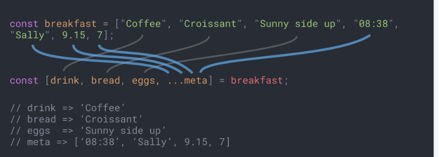
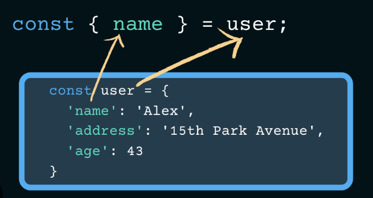

### Dynamically update DOM

```javascript
const newParagraph = document.createElement('p');
newParagraph.textContent = 'Another comment';
document.getElementById('root').append(newParagraph);
```

Navigate to https://www.jsplayground.dev/
### Understand different ES6 concepts
1. Let , const and var
2. arrow functions
3. array destructuring
4. object destructuring
5. String literals


## 1. Understand const
#### const is immutable
```javascript
const greet = "hello world";
greet = "somethingelse"

```

## 2. Understand block scope for let
#### this results in error since let is block scope
```javascript
function greet(){
    console.log('hello');
    const boolVal = true;
    if(boolVal){
        let somevar = 'hello world';
        console.log(somevar);
    }
    console.log(somevar)
}


greet();
```

## Understand global/fn scope for var
## since var has function scope it will display value
```javascript
function greet(){
  console.log('hello');
  const boolVal = true;
  if(boolVal){
    var somevar = 'hello world';
    console.log(somevar);
  }
  console.log(somevar)
}


greet();
```


## 5. Understand arrow functions
```javascript
function greet(){
  console.log('hello world')
}

const greet1 = () => {console.log('hello world2')}

greet()
greet1()
```

## 6. Understand array destructuring
```javascript
const testarr = [1, "one", ()=>{console.log('hello')}]

const[first,second,third]=testarr;

console.log(first);

third()
```


## 7. Understand object destructuring
```javascript
const person = {
    name : "megha",
    age : 14,
    address : "India"
}

const {name, ...rest} = person;
console.log(rest);

console.log('name',name)
```

## 8. String literals

```javascript
const name = 'John Doe'
const greet = `hello ${name}`
console.log(greet)
```